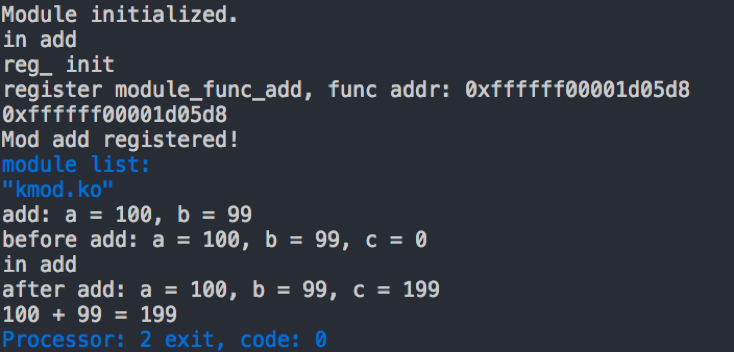

# Rucore LKM 实验报告

G15 计54 杨国炜 计54 乔一凡

## 总体概述

本项目是 2018 操作系统课程设计项目，基于 [Rust OS](https://github.com/wangrunji0408/RustOS)[1]，在其中实现内核可加载模块。我们的 Rust OS 运行在 X86 _64 平台，可以运行 32 位用户程序 insmod, rmmod, lsmod 并加载 64 位内核模块。

## 实验目标

### 目标概述

我们的实验目标主要分为三部分：

一是在 Rust OS 中实现内核可加载模块的支持，主要分为以下几部分：

1. 导出系统内核的符号和地址到内核符号表里，例如 kprintf 等，以供模块调用； 
2. 将内核模块读取到内存；
3. 解析模块的 ELF header，将变量加到符号表里； 
4. 重定位。因为加载之后 ELF 的符号地址已经发生改变，需要修正偏移量。 
5. 在操作系统层面提供载入并注册模块的接口 

二是实现加载卸载内核可加载模块的相关用户程序（insmod, rmmod, lsmod）；

三是为了进行最终的加载与测试，我们还需要实现内核模块并通过用户程序加载。

### 已完成工作

我们完成的工作如下：

* 完成了 OS 内核中的内核可加载模块的支持，能够加载内核模块，完成 ELF 解析，并且加载经来的内核模块可以正常调用内核符号（如 kprintf 等）；
* 完成了用户程序 insmod，rmmod，提供了加载和卸载内核模块程序。同时，insmod 可以读取模块等依赖关系并完成依赖内核模块的加载。（这部分工作参考蓝昶学长的代码[2]）
* 参考 kmod[4] 完成了内核模块，提供简单的加法函数用于测试。模块使用 Rust 完成，仅在与操作系统内核模块接口对接的地方使用了 C 代码。

### 未完成工作

我们目前 kernel module 的主要问题在于 register module 的处理。具体来说，我们在用户程序中需要将希望内核与其他内核模块使用的符号进行注册，将其地址记录在内核符号表中。然而我们发现目前我们穿到 register mod 中的函数地址并不是函数的真正地址。

我们通过解析内核模块的 ELF 头得到了模块中函数的地址，并通过这一地址成功进行了函数调用（如内核模块中的 add 函数）。并且通过对比地址我们发现内核模块中传给 register mod 的函数地址是错误的。

我们分析这一问题的原因可能是 rust 对于函数的处理方式与 C 不同，在 rust 中取函数地址的操作得到的并不是能够直接被外部调用的地址。但是在 OS 内核中我们也有导出符号到内核符号表中的操作，而且这些符号能够成功被内核符号调用，这两个地方我们的处理是一样的，因此我们对这个解释并不满意。另一个可能的原因是内核模块的编译链接方式是位置无关的，在这样的情况下程序获取函数地址的方式可能发生变化。具体的原因有待进一步的探究。

### 分工

我们的分工如下：乔一凡负责内核部分 kernel module 的支持，并为用户程序提供系统调用；杨国炜负责内核中模块记录表的实现，内核模块相关用户程序的实现和内核模块的实现。在实验中我们也一起进行了 debug 的工作。

## 已有工作

我们参考的已有工作主要有四个：

* Rust OS 是 G11 组王润基同学的代码，是基于 Rust 实现的 Ucore-like OS，有较为完整的内存管理，中断机制，进程管理，文件系统。我们基于此进行 Rust LKM 的扩展。
* Ucore Kernel Module 是蓝昶学长之前的 OS 课程项目，在 Ucore Plus 中实现了 X86_64 下的 kernel module 支持，提供了完整的 insmod，rmmod，lsmod 用户程序。我们参考了蓝昶学长的实现，并且基本复用了用户程序。
* Ucore 3.0 是路橙与于志竟成的 OS 课程项目，其中实现了 Rv64 下的 kernel module。我们主要参考了于志竟成的文档，由于代码结构与目标平台的不同，我们没有参考他们的代码。
* Kmod 是一个 rust based 的 kernel module，提供了简单的框架，使用 rust 实现 kernel module 的主体部分，仅在与操作系统的接口对接的部分使用了 C 代码。是一个简单但是实用的项目。我们基于 kmod 实现我们的加法模块。

## 项目结构

```
kmodule
├── consts.rs
├── export_func.rs
├── manager.rs
├── mod.rs
├── mod_loader.rs
└── utils.rs
```

其中：

* consts.rs 定义了 kernel module 实现中使用的常量，主要是 ELF 解析中用到的一些常量与一些模块符号字符串；
* export_func.rs 定义了导出内核符号的宏和 OS 导出的，希望提供给内核模块使用的函数
* manager.rs 进行模块的管理（目前使用链表实现了一个伪 hash 表进行模块管理），并提供相应的接口，包括模块的添加，删除，查询等功能。我们通过 manager 实现了目前加载进内核的模块的管理。
* mod.rs 提供了内核模块机制的基本函数，包括 do_init_module, do_cleanup_module, print_module 等，在相应系统调用时会调用这里的函数完成相应功能；
* mod_loader.rs 是内核模块机制的核心实现，包括 elf 文件的 sanity check，elf 文件的解析，以及相关函数的实现；
* utils.rs 中包括了一些其他模块使用的工具函数。

## 配置运行

编译运行 Rust OS 和 kmod 需要如下依赖 `nasm`, `grub-mkrescue`, `xorriso`, `qemu`, `rustc`, `rustup`, `cargo`, `xargo`, `x86_64-elf-gcc`, `x86_64-elf-binutils`。

配置主要分为三个部分：

1. 编译 kmod

   这部分只需要进入我们的 kmod 项目根目录运行 `make` 即可。如果想要查看编译信息可以使用`make VERBOSE=1`

2. 编译用户程序并生成磁盘文件

   这部分我们借用了 ucore 的编译。进入我们提供的 ucore 工程根目录，将第一步编译好的 kmod.ko 内核模块放入 `disk0/` 文件夹下，执行 `make clean && make`  即可。

3. 运行 Rust OS

由于 `Rust` 是一门相对年轻的语言，编译器更新很快，语言特性还在不断修改中，新版的 `rustc` 编译器可能无法顺利编译我们的代码。所以我们固定 `rustc` 版本为 `rustc 1.26.0-nightly (9c9424de5 2018-03-27)`
可以使用 `rustup` 进行 `rustc` 版本管理：

```bash
rustup default nightly-2018-03-27
rustup component add rust-src
```

我们使用 `cargo` 进行工程项目管理，在 `cargo.toml` 中声明了所有使用的外部 crate 以及版本，因此不必担心外部 crate 的版本问题。
我们使用 `xargo` 实现交叉编译。

编译运行时我们首先要将第二步生成好的用户程序磁盘拷贝到工程根目录下的 `user/` 文件夹下，并将磁盘文件命名为 `ucore32.img` 之后我们使用如下命令编译运行 Rust OS 即可：

```bash
make
make run
```

运行后即可看到加载内核模块后的情况。

大致效果如下：



## 实验说明

### 初始化

初始化的工作主要在导出内核符号。我们的设计与之前学长的设计类似，通过 hash 表维护内核符号表，记录内核符号的名称和入口地址，为了简单起见我们使用了全局数组来建立 hash 表。

```rust
pub static mut ex_sym_f: Mutex<[i32; EXPORT_SYM_HASH]> = Mutex::new([-1; EXPORT_SYM_HASH]);
pub static mut ex_sym_name: Mutex<[[u8; EXPORT_SYM_NAME_LEN]; EXPORT_SYM_COUNT_MAX]>
                                = Mutex::new([[0;EXPORT_SYM_NAME_LEN]; EXPORT_SYM_COUNT_MAX]);
pub static mut ex_sym_ptr: Mutex<[u64; EXPORT_SYM_COUNT_MAX]> = Mutex::new([0; EXPORT_SYM_COUNT_MAX]);
pub static mut ex_sym_flags: Mutex<[u32; EXPORT_SYM_COUNT_MAX]> = Mutex::new([0; EXPORT_SYM_COUNT_MAX]);
pub static mut ex_sym_n: Mutex<[i32; EXPORT_SYM_COUNT_MAX]> = Mutex::new([-1; EXPORT_SYM_COUNT_MAX]);

pub static mut ex_sym_count: Mutex<i32> = Mutex::new(0);
```

这里为了解决数据竞争的问题，rust 强制我们使用锁保护这些全局变量。

具体的导出内核符号的工作通过 mod_touch_symbol 函数完成，将符号与地址加入上面的全局内核符号表即可。

### 模块加载

模块的加载工作主要分成几个部分：

1. 根据系统调用传入的内核模块的名称将内核模块加载到内存中；
2. 检查内核模块 ELF 文件是否合法；
3. 解析内核模块，将符号加入符号表；
4. 重定位

---

其中，将模块加载到内存中的操作并不困难，这里我们实现上有一点小小的偷懒：我们读文件时首先在堆上开辟了一块缓冲区，读文件时将 ELF 文件内容读入缓冲区中，之后缓冲区中内容做操作。但是我们在加载内核模块后需要执行模块中的 init_module 函数，同时在后续的操作中我们也经常会有调用内核模块中函数的操作，这就要求我们执行入口地址在堆中的函数。但是堆是在内核的数据段中，而数据段是没有执行权限的，这就回造成我们在跳转到相应函数的地址时发生 GPF 错误。我们采用了王润基同学的建议，直接设置了数据段对应页表项具有执行权限，避开了这个问题。但是这样也降低了内核的安全性。

---

在 ELF 文件的 sanity check 中，我们使用 elf_hdr_check 完成这一工作。我们主要看的是以下几项：

* ELF magic，直接对比即可
* machine type：限制内核模块机器类型为 x86_64
* type: 需要  ELF 类型是 relocatable
* entry point: 对于普通 ELF 文件，其入口地址指向了入口函数，而内核模块没有入口函数，entry point 字段一定为 0
* 检查文件是否被截断，各个 section 是否完整， 是否越界
* 内核模块没有 program header table

---

ELF 文件的解析和重定位工作主要由 elf_mod_parse 完成。

在 ELF 文件的解析过程中，我们首先要遍历 ELF 文件的各个 section，当我们找到 symtab section 时，我们需要遍历符号表中的符号，对符号进行处理。

* 如果符号类型是 SHN_UNDEF，说明符号在内核模块编译链接时还没有定义，是对系统符号的引用。我们判断符号的名称（根据符号找到 strtab 中记录的符号名）；

  如果符号是 init_module 或 cleanup_module，我们需要根据符号的具体记录计算出目前 init_module 和 cleanup_module 的地址，并记录下这两个地址，以便在加载完毕/卸载时调用；

  如果符号的 binding 是 Global 或者 weak ，我们还需要将符号加入内核符号表中。

* 如果符号的类型是 SHN_COMMON，此时该符号在 ELF 文件中没有空间，需要我们为符号分配空间并修改符号地址，为符号提供地址。

当我们找到 nobits 段时，由于这个段对应 bss 段在 ELF 文件中虽然有定义但是没有分配空间，需要我们手动为其分配空间并修改相应地址。注意 rust 对于无符号整型的计算的溢出检查十分严格，不允许其溢出，因此我们需要特殊判断此时的溢出情况，而不能像 C 一样灵活利用溢出。

重定位操作是实现的另一个重点和难点。我们需要根据 ELF 文件中的 relocation table 进行符号的重定位，将文件里没有定义的符号关联到我们现在计算出的正确合法地址上。由于我们现在已经将模块加载到内存中，可以计算出函数的真实地址，因此我们可以将对符号的引用改到正确的地址上。

我们基于 rust 一个写好的库 xmas-elf 库帮助我们进行 elf 文件的解析。我们在模块上进行了小改动适应我们的需求，大量使用其中定义好的数据结构和函数。

我们只实现了对 Rela 类型的 relocation table section 的支持。这部分的平台相关性很大，需要对于每种类型做不同的处理。对于 relocation table 中的每一项，我们找到其对应的符号，根据符号的不同类型进行相应的操作：

* SHN_UNDEF：说明符号是内核符号，模块在调用内核提供的符号。我们在初始化的时候就完成了符号的导出工作，因此直接在内核符号表中查找到相应的符号地址；
* 普通的符号：这些符号没有特殊之处，只需要计算其现在的真实地址（ELF 文件的起始地址 + 符号所在段的段偏移 + 符号中记录的符号的段内偏移）；
* SHN_COMMON：这类型的符号在编译时没有提供空间，是我们在加载过程中手动分配空间的。在分配空间时，我们已经将符号在分配区域中的偏置记录在符号的 value（address）字段中，因此，我们现在只需要读取出符号的 value 字段的值并加上分配空间的起始地址即可。

在获取符号地址后，我们需要根据重定位项 addend 字段的值增加一个偏移，得到重定位填充时的实际填入的值。这里的 addend 一般是负数（如果看成符号数），同样会面临溢出的问题，需要进行特殊处理，先转成符号数计算后再转回无符号数。

对于 relocation table 中的项，我们需要根据其不同的类型使用不同的填充方法。我们这里参考了 linux，ucore plus 和蓝昶学长的实现：

```rust
match reloc.get_type() {
	R_X86_64_NONE   => {},
	R_X86_64_64     => {
		*(mem_addr as *mut u64) = val;
	},
    R_X86_64_32     => {
		*(mem_addr as *mut u32) = val as u32; 
	},
	R_X86_64_32S    => {
        *(mem_addr as *mut i32) = val as i32;
    },
    R_X86_64_PC32   => {
        let val32 = (val as i64 - mem_addr as i64) as u32;
        *(mem_addr as *mut u32) = val32;
    },
    R_X86_64_PLT32  => {
        let val32 = (val as i64 - mem_addr as i64) as u32;
        *(mem_addr as *mut u32) = val32; 
    },
    _               => {
        println!("unsupported relocation type ({:#x})", reloc.get_type());
	},
}
```

同时，我们在调试过程中发现，对于 x86_64 类型的内核模块，R_X86_64_32S 类型需要特殊处理。事实上，这里的 32S 指的是 32位截断，之后扩充回去的时候使用符号扩充。也就是说，这一截断要求对应符号的实际地址位于 0xffffffff80000000 - 0xffffffffffffffff 之间，否则在做 32 位截断的时候会直接截取前三十二位，如果前三十二位不全是 f 则再次符号扩展的时候就无法恢复了。

这就给我们的加载工作带来了很大的问题，因为我们不可能保证这些内核模块的符号在这个地址区间内。事实上我们的内核从没有使用过这部分地址。经过思考，我们认为不能使内核模块的编译链接是位置相关的，不能在内核模块中出现这样的绝对地址。我们希望能够以位置无关（PIC）的方式编译链接内核模块，避开这个问题。在 gcc 中，新版本的 gcc 已经默认开启了 `-fPIC` 编译选项，指定编译结果位置无关。而 rust 并没有默认这一点。经过对 rust 的编译链接过程的进一步学习，我们指定了 rust 为 pic 编译模式。经过重新编译后，新的内核模块中已经没有了 R_X86_64_32S 类型的重定位项。然而，此时多了一类重定位项，R_X86_64_PLT32。我们参考官方文档和 linux 实现代码进行填充。

完成重定位后，ELF 模块的解析工作就基本完成了。

之后我们调用在解析过程中获得的 init_module 函数，完成内核模块的加载过程。

elf_mod_parse 的主要框架如下：

```rust
pub fn elf_module_parse<'a>(elf: &'a ElfFile<'a>, BUF: &mut [u8], name: &str, export_symbol: bool, info: &mut elf_mod_info_s) -> i32 {
    println!("sh count = {}, sh size = {}", elf.header.pt2.sh_count(), elf.header.pt2.sh_entry_size());
    info.image = BUF.as_ptr() as u64;
    info.image_size = BUF.len();

    let mut cur_common_alloc = 0;
    let mut cur_common_align = 1;

    // parse
    let mut idx = 0;
    for sh in elf.section_iter() {	// iterate section
        sections::sanity_check(sh, &elf).unwrap();
        match sh.get_type() {
            Ok(ShType::SymTab) => {
					// ... get symtab
                    for sym in symtab {
                        if sym.shndx() != SHN_UNDEF && sym.shndx() < 0xff00 {
                            let sym_name = get_symbol_string(elf, BUF, sym.name());
                            match sym.get_binding() {
                                Ok(Binding::Local)  => {
                                    // ... get init/cleanup func ptr if any
                                },
                                Ok(Binding::Global) => {
                                    // ... get init/cleanup func ptr if any
                                    if export_symbol {
										// export symbol
                                    }
                                },
                                Ok(Binding::Weak)   => {
                                    if export_symbol {
                                        // export symbol
                                    }
                                },
                                Ok(_)               => {
                                    println!("unrecognized sym binding");
                                }
                                Err(_)              => {
                                    println!("error sym binding!");
                                }
                            };
                        } else if sym.shndx() == SHN_COMMON {
                            // alloc space and set sym.value
                        } else {
                            println!("shndx[{:#x}]", sym.shndx());
                        }
                        sym_idx += 1;
                    }
                }
            },
            Ok(ShType::NoBits) => {
                // alloc space for bss
            },
            _       => {},
        }
        idx += 1;
    }

	// ... alloc bss space

    // relocation. fill the relocation entries
    for sh in elf.section_iter() {
        match sh.get_type() {
            Ok(ShType::Rela) => { // only support rela
                if let sections::SectionData::Rela64(reloc_list) = sh.get_data(elf).ok().expect("get rela table failed") { // get reloc list
                    for reloc in reloc_list {
                        // ... get corresponding symbol
                        unsafe {
                            if (*symtab).shndx() == SHN_UNDEF {
                                //... find addr from export_sym_table
                                }
                            } else if (*symtab).shndx() < 0xff00 {
                                // ... calculate symbol real addr
                            } else if (*symtab).shndx() == SHN_COMMON {
                                reloc_addr = common_space + (*symtab).value(); // get from memory pool
                            } else {
                                debug!("Error: unhandled sym shndx");
                            }
                        }
                        let mut val = (reloc_addr as i64 + reloc.get_addend() as i64) as u64; 	// add addend

                    	// fill entries
                        use super::consts::*;
                        unsafe {
                            match reloc.get_type() {
                                R_X86_64_NONE   => {},
                                R_X86_64_64     => {
                                    *(mem_addr as *mut u64) = val;
                                },
                                R_X86_64_32     => {
                                    *(mem_addr as *mut u32) = val as u32; 
                                },
                                R_X86_64_32S    => {
                                    *(mem_addr as *mut i32) = val as i32;
                                },
                                R_X86_64_PC32   => {
                                    let val32 = (val as i64 - mem_addr as i64) as u32;
                                    *(mem_addr as *mut u32) = val32;
                                },
                                R_X86_64_PLT32  => {
                                    let val32 = (val as i64 - mem_addr as i64) as u32;
                                    *(mem_addr as *mut u32) = val32; 
                                },
                                _               => {
                                },
                            }
                        }
                    }
                }
            },
            Ok(ShType::Rel)  => {
                debug!("Error: relocation TYPE rel not implmented");
            },
            Ok(_)            => {},
            Err(_)           => println!("Error in get sh type"),
        }
    }
    0
}
```


### 模块卸载

模块卸载时我们需要先调用之前加载模块时解析得到的 cleanup_module 函数，之后从我们记录的内核模块表中删除模块即可。

扩展：这里我们没有考虑模块间的依赖关系，事实上我们可以通过为模块增加引用计数来解决这个问题。当模块的引用计数大于 1 时我们只需要减少模块的引用计数，而不需要真正将模块移除，只有模块不再被任何一个模块使用时才真正卸载一个模块。

### 用户程序

我们主要参考蓝昶学长的实现实现了 insmod，rmmod，lsmod 用户程序。在 Rust OS 中我们提供了相应的系统调用来进行模块加载， 模块卸载，模块打印等功能，在用户程序中相应调用接即可。

在 insmod 中也会有对模块依赖关系等加载，但是我们由于时间原因以及内核模块中符号的调用问题没有测试模块依赖关系。

由于目前的 Rust OS 没有实现从键盘读取输入并将字符串返回给用户的系统调用，我们采用了将模块名称写死在代码中进行加载卸载的方法进行运行，经过实验可以成功运行。

### 内核模块

我们开始的时候参考了很多 rust 实现的内核模块，但是由于 rust 更新很快，很多模块现在已经无法编译了。最终 我们选择了 kmod 来构造自己的内核模块。

我们主要参考了 kmod 来实现我们的内核模块。在工程中有一个 C 文件，用于 include linux 中内核模块有关的头文件并声明 init_module 和 cleanup_module 两个函数。而函数的具体实现是在 rust 中，并将函数导出给 C 文件调用，从而实现了使用 rust 实现内核模块的目标。

经过测试，我们的内核模块可以被正常加载并调用内核 krpintf 符号打印字符串。

同时，由于 rust 不支持可变参数，我们无法使用函数完成一个类似 printf 功能的函数（在 rust 中这是由宏进行递归展开的方法实现的），我们导出的 kprintf 只能打印字符串而不支持形式化参数。

## 实验过程日志

详见 wiki 页面过程记录 [http://os.cs.tsinghua.edu.cn/oscourse/OS2018spring/projects/g15](http://os.cs.tsinghua.edu.cn/oscourse/OS2018spring/projects/g15)

## 实验总结

这次实验是基于我们之前使用 rust 写 os 的扩展，使用了其他组同学更加完善的代码作为基础。虽然时间比较紧张，但是我们在之前的调研中已经对内核可加载模块有了一定的了解，因此最后也基本完成了主要任务。在实现过程中，我们对 ELF 文件的具体格式有了进一步的了解，对重定位的过程等等也有了更深入的理解。同时，随着写 rust 代码时间的增加，我们也逐渐体会到 rust 的安全设计哲学与内存管理的思路，也对 rust 诸如宏，导出函数等等语言特性有了更深的理解。在我看来，rust 在某些语言特性上的确更加先进，如 rust 的宏功能更强更安全，但是有的地方 rust 不如 C 那么容易写，如函数地址的获取，不支持可变参数等等，可见语言的特性是不可能完全适合每个应用场景的，总体来说 rust 与 c 写 OS 各有千秋。

实验过程中我们也得到了老师同学的很多帮助，也十分感谢老师和王润基同学给我们的提示和帮助。

## 参考文献与代码

[1] Rust OS. G11 王润基组代码. https://github.com/wangrunji0408/RustOS

[2] Ucore Kernel Module. 蓝昶. https://github.com/luoshuifish/ucore-kernel-module

[3] Risv5 64 Kernel Module. G08 于志竟成，路橙. https://github.com/riscv-labs/OS2018spring-projects-g08

[4] kmod. Sascha Grunert. https://github.com/saschagrunert/kmod